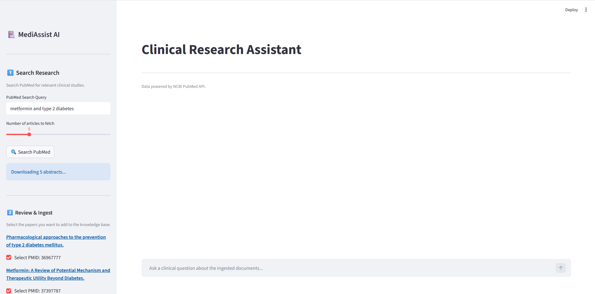
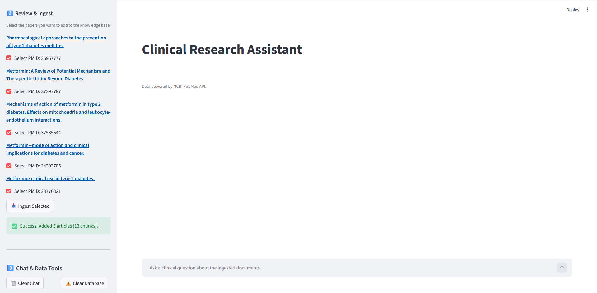
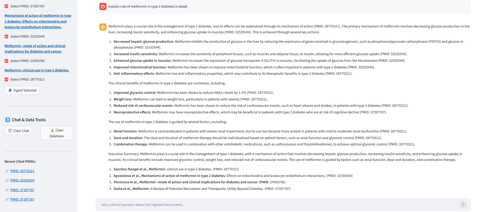

# MediAssist AI | Clinical Research Assistant

MediAssist AI is a dynamic Retrieval-Augmented Generation (RAG) application designed to help researchers and medical professionals quickly analyze clinical evidence. It allows users to search the PubMed database directly from the interface, download real medical papers, and interact with an AI that answers questions strictly based on the downloaded literature.

---

## 🌐 Live Demo

🔗 **Streamlit Cloud App:**  
https://medi-assist-ai-rag-v2.streamlit.app/

---

## 📸 Application Screenshots

### 1. Search Query


### 2. Paper Selection & Ingestion


### 3. Chat Interface


---

## 🧩 The Problem

Reading through dozens of dense medical papers to find a specific answer takes a lot of time. While standard AI models can summarize information quickly, they often suffer from hallucinations — generating incorrect medical claims or fake research references when the answer is uncertain.

---

## ✅ The Solution

MediAssist AI solves this problem using a strict RAG (Retrieval-Augmented Generation) pipeline.

1. It retrieves real, peer-reviewed abstracts from the NCBI PubMed database.
2. It stores the selected papers in a temporary localized vector database.
3. It forces the AI model to answer questions using **only** the downloaded literature.
4. If the answer is unavailable in the retrieved papers, the AI clearly states that the information does not exist in the current database instead of generating fake answers.

This significantly reduces hallucinations and improves factual reliability.

---

## ✨ Key Features

### 🔍 Dynamic PubMed Ingestion
Search for any medical topic directly inside the application, review the fetched papers, and select exactly which studies should be added to the AI knowledge base.

### 🧠 Smart Intent Routing
Uses semantic routing to determine whether the user is engaging in casual conversation or asking a clinical research question, avoiding unnecessary database retrieval for simple interactions.

### 📚 Evidence-Based Citations
Every clinical claim includes inline PubMed citations such as `[PMID: 41164517]`. The application automatically extracts these citations and provides direct links to the original papers.

### 💬 Conversation Memory
The chatbot remembers previous messages during the active session, allowing natural follow-up questions and multi-turn discussions.

### 🗑️ Database Reset
Users can clear the vector database at any time to start researching a completely different medical topic without mixing old and new research papers.

---

## 🛠️ Technology Stack

| Component | Technology |
|---|---|
| Frontend | Streamlit |
| AI Model | Groq (`llama-3.3-70b-versatile`) |
| Framework | LangChain |
| Vector Database | ChromaDB |
| Embeddings | HuggingFace (`sentence-transformers/all-MiniLM-L6-v2`) |
| Intent Classification | Semantic Router |
| Package Manager | uv |

---

## 📂 Project Structure

```text
MEDI-ASSIST-AI-V2/
├── app.py                 # Main Streamlit user interface and application logic
├── rag_chain.py           # LangChain RAG pipeline, embedding logic, and prompt engineering
├── router.py              # Semantic routing logic (Chitchat vs Clinical)
├── pubmed.py              # Custom PubMed API scraper (NCBI E-utilities)
├── main.py                # Additional application logic / entry point
├── requirements.txt       # Project dependencies for deployment
├── pyproject.toml         # Project metadata and dependencies managed by uv
├── uv.lock                # Lockfile for exact dependency versions
├── .python-version        # Python version configuration
├── .gitignore             # Ignores secrets and local database files
```

---

## ⚙️ Local Setup & Installation

This project uses `uv`, a fast Python package installer and dependency manager.

### 1. Clone the Repository

```bash
git clone https://github.com/shaikhmaaz04/medi-assist-ai-v2.git
cd medi-assist-ai
```

### 2. Create a Virtual Environment

```bash
uv venv
```

### 3. Activate the Environment

#### Windows
```bash
.venv\Scripts\activate
```

#### macOS / Linux
```bash
source .venv/bin/activate
```

### 4. Install Dependencies

```bash
uv sync
```

### 5. Configure Environment Variables

Create a `.env` file in the project root directory:

```env
GROQ_API_KEY=your_groq_api_key_here
```

### 6. Run the Application

```bash
streamlit run app.py
```

---

## 🚀 How to Use the Application

### 1. Start Fresh
Launch the application. Initially, the database is empty.

### 2. Search PubMed
Enter a medical search query such as:

```text
Metformin AND Type 2 Diabetes
```

Then click **"Search PubMed"**.

### 3. Select & Ingest Papers
Choose the medical papers you want the AI to analyze and click **"Ingest Selected"**.

### 4. Ask Clinical Questions
Use the chatbot interface to ask questions related to the ingested research papers.

### 5. Verify Citations
Review the inline citations and use the provided PubMed links to verify the original research sources.

### 6. Clear the Database
Use the **"Clear Database"** button whenever you want to begin researching a new topic.

---

## 🔒 Hallucination Prevention

MediAssist AI is designed with strict prompt engineering and retrieval constraints.

- The AI can only answer using retrieved PubMed context.
- Every medical claim must include a PubMed citation.
- If the information is unavailable, the AI refuses to generate unsupported answers.
- References are dynamically generated only from the current research context.

This makes the system significantly more reliable for educational clinical research exploration.

---

## ⚠️ Disclaimer

This project is created strictly for educational and demonstration purposes only.

It is **not intended for commercial deployment, medical diagnosis, treatment, or professional healthcare decision-making**. The generated responses should not be considered medical advice.

Always consult qualified healthcare professionals for medical guidance and treatment decisions.